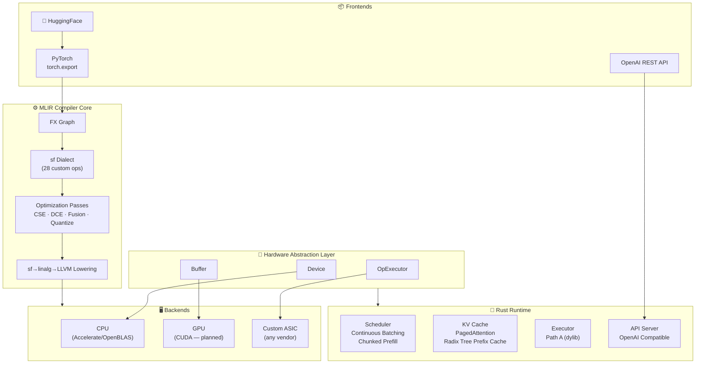
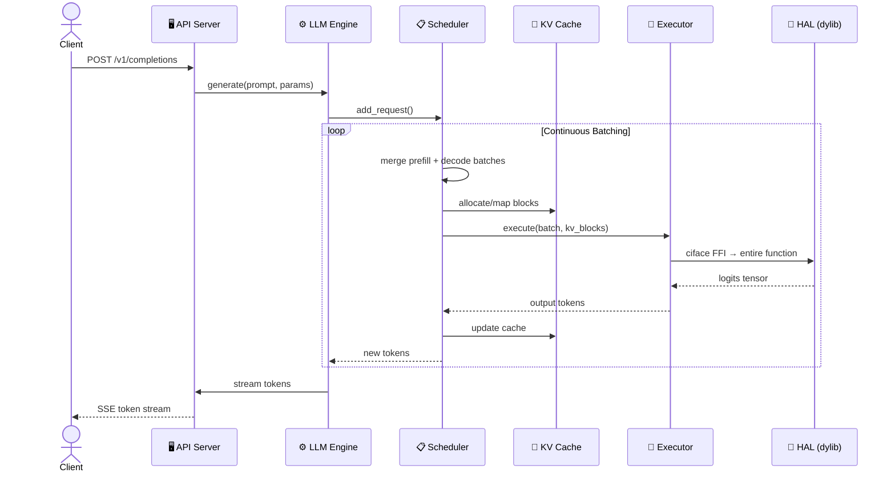

# LLM-CompileForge

**Hardware-Agnostic LLM Inference Compiler & Runtime — Phase 1 MVP**

[中文文档](README_CN.md) | [Contributing](CONTRIBUTING.md)

---

LLM-CompileForge is a **compiler-first LLM inference system** built on MLIR. It compiles HuggingFace models into native shared libraries (`.dylib`/`.so`) that run on any hardware through a minimal **Hardware Abstraction Layer (HAL)**. Only 3 interfaces — `Device`, `Buffer`, `OpExecutor` — stand between your AI accelerator and production-grade serving.

**Not another vLLM clone.** LLM-CompileForge is a new category: an MLIR-centric compiler OS that covers training & inference, cloud & edge, text & multimodal — all hardware-agnostic.

## Why?

AI chip fragmentation is imminent. Every new accelerator forces framework developers to rewrite backends from scratch. LLM-CompileForge inverts this: **implement 3 HAL interfaces once, and all models compile & run at top performance forever.**

| Traditional Approach | LLM-CompileForge |
|---|---|
| 2–4 person-months per chip | < 2 person-weeks per chip |
| Manual kernel rewriting | MLIR compiler automation |
| Framework-locked | Any model, any hardware |
| Python-bound | AOT-compiled Rust binaries for edge/confidential computing |

## Architecture



## Compilation Pipeline

```mermaid
flowchart LR
    subgraph Step1["Step 1: Export"]
        A["🤗 HF Model<br/>opt-125m / Llama"] --> B["torch.export"]
        B --> C["FX Graph<br/>(ATen ops)"]
    end

    subgraph Step2["Step 2: MLIR Dialect"]
        C --> D["fx_graph_to_mlir()<br/>sf dialect emission"]
        D --> E["model.mlir<br/>+ metadata.json<br/>+ constants.bin"]
    end

    subgraph Step3["Step 3: Lowering"]
        E --> F["sf→linalg<br/>(C++ pass)"]
        F --> G["linalg→LLVM<br/>(canonicalize · tile ·<br/>bufferize · cf · llvm)"]
        G --> H["mlir-translate → .ll"]
        H --> I["llc → .o → .dylib"]
    end

    subgraph Step4["Step 4: Runtime"]
        I --> J["Rust libloading"]
        J --> K["Inference<br/>forward pass"]
    end

    style Step1 fill:#e3f2fd,stroke:#1976d2
    style Step2 fill:#e8f5e9,stroke:#388e3c
    style Step3 fill:#fff3e0,stroke:#f57c00
    style Step4 fill:#fce4ec,stroke:#c62828
```



## Inference Flow (Sequence)



## Current Status

| Metric | Value |
|---|---|
| **Path A (dylib) vs HF cosine** | cos_sim = 1.0000000000 ✅ (verified: 5 configs × E2E cross-validation, Rust forward_check, Rust server) |
| **Path A server (Rust)** | Token-exact greedy match ✅ (verified with real GPT2 tokenizer) |
| **Path A (dylib with KV cache)** | KV infrastructure tests pass; numerical cos comparison pending |
| **Path B (HAL IR)** | ~~Deprecated~~ — removed from Makefile |
| **Models supported** | opt-125m, tiny-llama |
| **Compilation time (opt-125m)** | ~4 min (llc O0 dominates) |
| **Inference correctness** | Token-exact greedy match ✅ (Rust server == HF) |
| **HAL operators** | 28 ops (reduce, element_wise, gather, matmul, attention...) |
| **Test suite** | compiler: TDD precision tests (sf.view/transpose, arange, SDPA mask) + op composition framework + op-level bisect tool; runtime: 7 runner consistency tests; all layers verified |
| **KV Cache** | PagedAttention with Radix Tree prefix cache |

## Project Structure

```
LLM-CompileForge/
├── compiler/              # Python compiler: FX Graph → MLIR → .dylib
│   ├── fx/                #   FX Graph → sf dialect conversion
│   ├── pipeline/          #   Compilation orchestration (compile_mlir)
│   ├── backend/           #   LLVM backend (lowering pipeline + llc)
│   ├── passes/            #   MLIR optimization passes
│   ├── dialect/           #   sf dialect Python definitions
│   └── artifact/          #   MlirModule I/O
├── runtime/               # Rust runtime: scheduler, executor, KV cache
│   ├── src/hal/           #   HAL (Hardware Abstraction Layer)
│   ├── src/hal/primitives/#   Low-level kernels (matmul, attention...)
│   ├── src/engine/        #   Inference engine (runner, executor, sampler, tokenizer)
│   └── src/model/         #   ABI parsing, compute graph, weight loading
├── python_runtime/        # Python runtime: HAL, Engine, Server
│   ├── hal/               #   HAL ABCs (Device, Buffer, OpExecutor)
│   ├── engine/            #   LLM Engine, scheduler, sampler
│   └── server/            #   FastAPI OpenAI-compatible server
├── sf-dialect/            # C++ MLIR dialect: sf ops + lowering passes
├── include/               # Contract layer: sfa.h + sfa_abi.proto
├── kernels/               # PyTorch kernel implementations
│   ├── flash_attention.py
│   ├── rms_norm.py
│   └── quantize/
└── tests/                 # End-to-end & integration tests
```

## Quick Start

### Prerequisites

- Python 3.10 (managed by [uv](https://github.com/astral-sh/uv))
- Rust toolchain (`rustc`, `cargo`)
- macOS (primary dev platform) / Linux (CI-tested)

### Setup

```bash
# 1. Clone with submodules (LLVM/MLIR)
git clone --recurse-submodules https://github.com/silentlin/LLM-CompileForge.git
cd LLM-CompileForge

# 2. One-command setup (installs uv, creates venv, builds LLVM)
bash scripts/setup.sh

# 3. Activate environment
source .venv/bin/activate

# 4. Run unit tests (should pass in ~6s)
make test-unit
```

### Compile a Model

```bash
# Full pipeline: compile opt-125m → .dylib → Rust binary
make build-all MODEL=opt-125m
# or for tiny-llama
make build-all MODEL=tiny-llama
```

This produces:
- `outputs/compiled/opt_125m_fresh/model.mlir` — MLIR artifact
- `outputs/compiled/opt_125m_fresh/libopt_125m.dylib` — Compiled shared library
- `runtime/target/release/serveforge` — Rust inference binary

### Run Inference

```bash
# Start API server
make serve MODEL=opt-125m

# In another terminal:
curl http://localhost:8000/health
curl -X POST http://localhost:8000/v1/completions \
  -H "Content-Type: application/json" \
  -d '{"prompt": "Hello, world!", "max_tokens": 50}'

# Or run a single prompt via CLI
make run-prompt PROMPT="The meaning of life is" MAX_TOKENS=32
```

## Execution Paths

LLM-CompileForge has one active execution mode (Path A). Path B (HAL IR) was deprecated and removed.

### Path A (dylib)

The compiled `.dylib` exports ciface functions per model layer. The Rust runtime loads the dylib via `libloading`, constructs MemRef descriptors, and calls each function in topological SSA order.

| Aspect | Detail |
|--------|--------|
| **Execution unit** | Entire function (single FFI call) |
| **Runner** | `compute_graph_runner.rs` |
| **Executable** | `CpuExecutable` (loads .dylib) |
| **Correctness** | cos_sim = 1.0000000000 vs HF (verified: Python ctypes, Rust forward_check, Rust server) |
| **Purpose** | Production serving |

### Path B (HAL IR) — Deprecated

Previously attempted op-by-op dispatch in pure Rust via `hal_runner.rs`. Removed due to build infrastructure issues. See git history for the HAL IR prototype.

## Feedback Loops

| Level | Command | Purpose | Budget |
|---|---|---|---|
| L0 | `make lint` | ruff + mypy | <2s |
| L1 | `make test-unit` | 298+ unit tests | <6s |
| L1.5 | `make test-forward-smoke` | Forward NaN check | <5s |
| L2 | `make test-pipeline-smoke` | Pipeline + Rust integration | <90s |
| L3 | `make profile` | Performance baseline | <5min |
| Full | `make build-all` | End-to-end compilation + inference | ~5min |

## Development

```bash
make lint          # Static analysis (ruff + mypy)
make test-unit     # Fast unit tests
make test-fast     # lint + unit + pipeline quick + smoke
make test-all      # Full test suite
make verify-dylib-fresh  # Check dylib freshness
```

Bug fix workflow:
1. Write a unit test that reproduces the bug (must fail before the fix)
2. Implement the fix
3. `make lint && make test-unit`
4. `make smoke`

## Design Principles

1. **Contract-Driven**: All sub-projects depend only on `include/sfa.h` + `include/sfa_abi.proto`. No cross-project implementation dependencies.
2. **Compile-First, Hand-Write When Necessary**: MLIR passes handle 90% of optimizations; HAL backends inject hand-tuned kernels for the last 10%.
3. **Rust Core, Python Shell**: Safety-critical runtime in Rust; flexible ecosystem interface in Python.
4. **Train-Infer Unified**: Same IR, same HAL, same runtime — different compilation outputs.
5. **Sub-Project Independence**: Each sub-project (sf-dialect, compiler, runtime) is independently testable against the contract alone.

## Phase 1 Scope (Current)

- [x] Rust HAL core (Device, Buffer, OpExecutor — 28 ops)
- [x] MLIR fusion passes (RMSNorm-MatMul, SiLU-Mul)
- [x] torch.export → FX Graph → sf dialect compilation
- [x] sf→linalg→LLVM→.dylib lowering pipeline
- [x] PagedAttention KV Cache with Radix Tree prefix cache
- [x] Continuous Batching + Chunked Prefill scheduler
- [x] OpenAI-compatible REST API server
- [x] Path A inference: cos_sim = 1.0000000000 vs HF, token-exact greedy match ✅
- [x] TDD precision infrastructure: HF golden generation, op composition tests, op-level bisect
- [x] sf.view -1 sentinel dynamic shape bug fixed
- [ ] Path A with KV cache numerical cos verification
- [ ] NVIDIA GPU backend (CUDA)
- [ ] Quantization toolchain (AWQ, SmoothQuant)
- [ ] Path B rebuild (HAL IR op-by-op dispatch)

## License

Apache 2.0 © 2026 — see [LICENSE](LICENSE) for full text.

## Acknowledgments

Built on the shoulders of [LLVM/MLIR](https://mlir.llvm.org/), [PyTorch](https://pytorch.org/), and the open-source LLM serving community.
