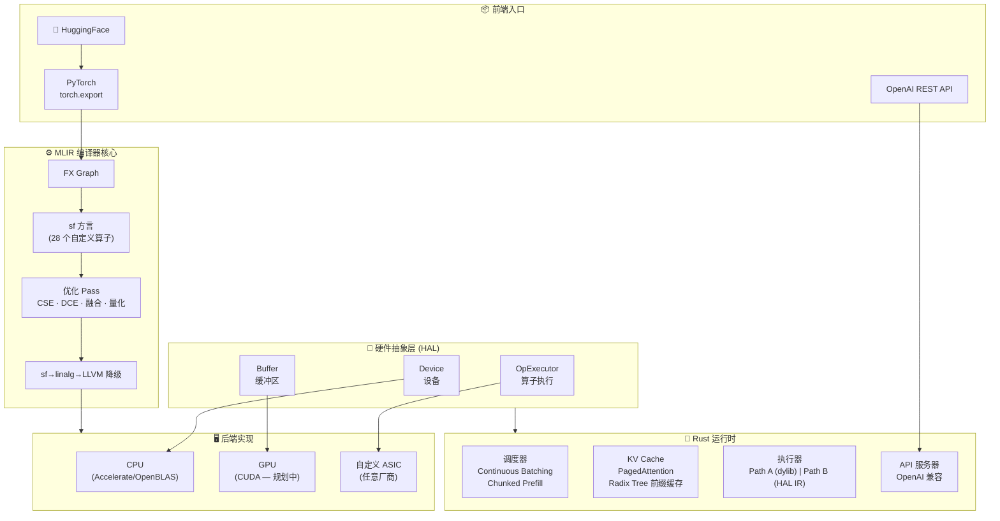
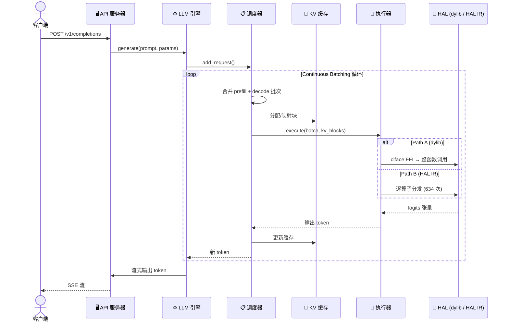

# LLM-CompileForge

**硬件无关的大模型推理编译器与运行时 — Phase 1 MVP**

[English](README.md) | [贡献指南](CONTRIBUTING.md)

---

LLM-CompileForge 是一个基于 MLIR 的**编译器优先的大模型推理系统**。它将 HuggingFace 模型编译为原生动态库（`.dylib`/`.so`），通过极简的**硬件抽象层（HAL）**在任何硬件上运行。只需实现 3 个接口——`Device`、`Buffer`、`OpExecutor`——即可让你的 AI 加速器获得生产级推理能力。

**这不是又一个 vLLM 克隆。** LLM-CompileForge 是一个全新的品类：以 MLIR 编译器为中枢的 AI 部署操作系统，覆盖训练与推理、云端与边缘、文本与多模态——全部硬件无关。

## 为什么？

AI 芯片碎片化即将爆发。每一种新的加速器都迫使框架开发者从头重写后端。LLM-CompileForge 反转了这个逻辑：**一次性实现 3 个 HAL 接口，所有模型即可永久以顶级性能编译运行。**

| 传统方案 | LLM-CompileForge |
|---|---|
| 每款芯片 2–4 人月 | 每款芯片 < 2 人周 |
| 手工编写内核 | MLIR 编译器自动化 |
| 绑定特定框架 | 任何模型、任何硬件 |
| Python 依赖 | AOT 编译 Rust 二进制，适用于边缘/机密计算 |

## 总体架构



## 编译流水线

```mermaid
flowchart LR
    subgraph Step1["第一步：模型导出"]
        A["🤗 HF 模型<br/>opt-125m / Llama"] --> B["torch.export"]
        B --> C["FX Graph<br/>(ATen 算子)"]
    end

    subgraph Step2["第二步：MLIR 方言"]
        C --> D["fx_graph_to_mlir()<br/>生成 sf 方言"]
        D --> E["model.mlir<br/>+ metadata.json<br/>+ constants.bin"]
    end

    subgraph Step3["第三步：降级编译"]
        E --> F["sf→linalg<br/>(C++ pass)"]
        F --> G["linalg→LLVM<br/>(规范化 · 分块 ·<br/>缓冲区化 · cf · llvm)"]
        G --> H["mlir-translate → .ll"]
        H --> I["llc → .o → .dylib"]
    end

    subgraph Step4["第四步：运行时"]
        I --> J["Rust libloading 加载"]
        J --> K["推理<br/>前向传播"]
    end

    style Step1 fill:#e3f2fd,stroke:#1976d2
    style Step2 fill:#e8f5e9,stroke:#388e3c
    style Step3 fill:#fff3e0,stroke:#f57c00
    style Step4 fill:#fce4ec,stroke:#c62828
```



## 推理流程（时序图）



## 当前效果

| 指标 | 数值 |
|---|---|
| **Path A (dylib) 与 HF 余弦相似度** | cos_sim = 1.000000 ✅ |
| **支持模型** | opt-125m, tiny-llama |
| **编译时间 (opt-125m)** | ~4 分钟（llc O0 占大头） |
| **推理正确性** | Greedy 逐 token 完全一致 ✅ |
| **HAL 算子数量** | 28 个（reduce, element_wise, gather, matmul, attention...） |
| **测试套件** | 298+ 个单元测试 + 集成测试 + 基线测试 |
| **KV Cache** | PagedAttention + Radix Tree 前缀缓存 |

## 项目结构

```
LLM-CompileForge/
├── compiler/              # Python 编译器：FX Graph → MLIR → .dylib
│   ├── fx/                #   FX Graph → sf 方言转换
│   ├── pipeline/          #   编译编排（compile_mlir 入口）
│   ├── backend/           #   LLVM 后端（降级流水线 + llc）
│   ├── passes/            #   MLIR 优化 Pass
│   ├── dialect/           #   sf 方言 Python 定义
│   └── artifact/          #   MlirModule 读写
├── runtime/               # Rust 运行时：调度器、执行器、KV 缓存
│   ├── src/hal/           #   HAL Rust 后端（Path B 算子处理）
│   ├── src/hal_runner/    #   HAL IR 图执行器
│   ├── src/hal/primitives/#   底层内核（矩阵乘、注意力等）
│   └── src/executor.rs    #   推理 step 循环
├── python_runtime/        # Python 运行时：HAL、引擎、服务器
│   ├── hal/               #   HAL 抽象接口（Device, Buffer, OpExecutor）
│   ├── engine/            #   LLM 引擎、调度器、采样器
│   └── server/            #   FastAPI OpenAI 兼容服务
├── sf-dialect/            # C++ MLIR 方言：sf 算子定义 + 降级 Pass
├── include/               # 契约层：sfa.h + sfa_abi.proto
├── kernels/               # PyTorch 算子实现
│   ├── flash_attention.py
│   ├── rms_norm.py
│   └── quantize/
└── tests/                 # 端到端 & 集成测试
```

## 快速开始

### 环境要求

- Python 3.10（由 [uv](https://github.com/astral-sh/uv) 管理）
- Rust 工具链（`rustc`、`cargo`）
- macOS（主要开发平台）/ Linux（CI 测试通过）

### 环境搭建

```bash
# 1. 克隆仓库（含 LLVM/MLIR 子模块）
git clone --recurse-submodules https://github.com/silentlin/LLM-CompileForge.git
cd LLM-CompileForge

# 2. 一键初始化（安装 uv、创建 venv、编译 LLVM）
bash scripts/setup.sh

# 3. 激活环境
source .venv/bin/activate

# 4. 运行单元测试（约 6 秒全部通过）
make test-unit
```

### 编译模型

```bash
# 完整流水线：编译 opt-125m → .dylib → Rust 二进制
make build-all MODEL=opt-125m
# 或者编译 tiny-llama
make build-all MODEL=tiny-llama
```

产物包括：
- `outputs/compiled/opt_125m_fresh/model.mlir` — MLIR 产物
- `outputs/compiled/opt_125m_fresh/libopt_125m.dylib` — 编译后的动态库
- `runtime/target/release/serveforge` — Rust 推理二进制

### 运行推理

```bash
# 启动 API 服务器
make serve MODEL=opt-125m

# 在另一个终端：
curl http://localhost:8000/health
curl -X POST http://localhost:8000/v1/completions \
  -H "Content-Type: application/json" \
  -d '{"prompt": "你好，世界！", "max_tokens": 50}'

# 或者通过 CLI 运行单条 prompt
make run-prompt PROMPT="生命的意义是" MAX_TOKENS=32
```

## 两条执行路径

LLM-CompileForge 支持两种执行模式，编译时选择：

| | Path A (dylib) | Path B (HAL IR) |
|---|---|---|
| **执行单元** | 整函数（单次 FFI） | 逐算子分发（634 次 Rust 调用） |
| **Runner** | `compute_graph_runner.rs` | `hal_runner.rs` |
| **Executable** | `CpuExecutable`（加载 .dylib） | `HalRustExecutable`（纯 Rust） |
| **Feature 开关** | 默认 | `--features hal-rust` |
| **正确性** | cos_sim = 1.0 ✅ | NaN（开发中 — 类型追踪） |
| **用途** | 生产级推理服务 | 验证与新硬件适配 |

## 反馈环

| 级别 | 命令 | 用途 | 耗时 |
|---|---|---|---|
| L0 | `make lint` | ruff + mypy 静态检查 | <2s |
| L1 | `make test-unit` | 298+ 单元测试 | <6s |
| L1.5 | `make test-forward-smoke` | 前向 NaN 检查 | <5s |
| L2 | `make test-pipeline-smoke` | 流水线 + Rust 集成 | <90s |
| L3 | `make profile` | 性能基线 | <5min |
| 完整 | `make build-all` | 端到端编译 + 推理 | ~5min |

## 开发

```bash
make lint          # 静态分析 (ruff + mypy)
make test-unit     # 快速单元测试
make test-fast     # lint + unit + pipeline quick + smoke
make test-all      # 完整测试套件
make verify-dylib-fresh  # 检查 dylib 是否过期
```

Bug 修复流程：
1. 先写复现 bug 的单元测试（修复前必须失败）
2. 实现修复
3. `make lint && make test-unit`
4. `make smoke`

## 设计原则

1. **契约驱动**：所有子项目仅依赖 `include/sfa.h` + `include/sfa_abi.proto` 定义的接口，不依赖其他子项目的实现。
2. **编译优先，手写兜底**：MLIR Pass 处理 90% 的优化；HAL 后端注入手写内核覆盖最后 10%。
3. **Rust 为核，Python 为壳**：安全性关键的运行时用 Rust；灵活的生态接口用 Python。
4. **训推一体**：同一个 IR、同一个 HAL、同一个运行时——只是编译输出不同。
5. **子项目独立**：每个子项目（sf-dialect、compiler、runtime）可仅凭契约独立测试。

## Phase 1 范围（当前）

- [x] Rust HAL 核心（Device, Buffer, OpExecutor — 28 算子）
- [x] MLIR 融合 Pass（RMSNorm-MatMul, SiLU-Mul）
- [x] torch.export → FX Graph → sf 方言编译
- [x] sf→linalg→LLVM→.dylib 降级流水线
- [x] PagedAttention KV Cache + Radix Tree 前缀缓存
- [x] Continuous Batching + Chunked Prefill 调度器
- [x] OpenAI 兼容 REST API 服务器
- [x] Path A 推理（与 HF 对比 cos_sim = 1.0）
- [ ] Path B 推理（NaN → 开发中）
- [ ] NVIDIA GPU 后端（CUDA）
- [ ] 量化工具链（AWQ, SmoothQuant）

## 许可证

Apache 2.0 © 2026 — 详见 [LICENSE](LICENSE)。

## 致谢

站在 [LLVM/MLIR](https://mlir.llvm.org/)、[PyTorch](https://pytorch.org/) 和开源大模型推理社区的肩膀上。
